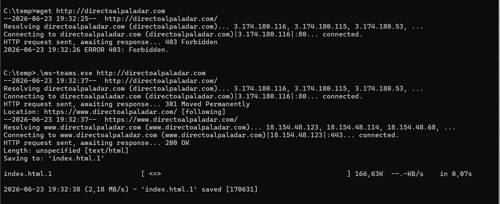

Imagina que estás auditando un entorno corporativo. El cliente tiene Netskope desplegado en todos los `endpoints`, las políticas de bloqueo configuradas, el DLP en marcha y la consola muestra millones de eventos por día. Sobre el papel, todo el tráfico que sale de cada dispositivo pasa por la plataforma antes de llegar a Internet y bloquea todo lo que no sea legítimo o con datos sensibles. Es una de esas afirmaciones que el cliente da por hechas y que, como `pentester`, deberíamos verificar.

La pregunta incómoda es: ¿y si no es cierto? ¿Y si hay procesos enteros cuyo tráfico no aparece en `SkopeIT`, no se inspecciona, no se filtra y no genera ni un solo log? No por un fallo del agente ni una vulnerabilidad del producto, sino por una funcionalidad legítima de Netskope mal configurada, algo que cualquier usuario del dispositivo, sin privilegios administrativos, puede descubrir y aprovechar con un par de comandos.

En este artículo voy a recorrer cómo identificar esta clase de configuración vulnerable durante un ejercicio de `pentesting`: dónde mirar, qué buscar, cómo evidenciarlo para el informe y qué recomendar al cliente. La técnica gira en torno a un componente concreto del agente, las `Certificate Pinned Apps` y, sobre todo, en torno a lo que ocurre cuando esa funcionalidad se despliega sin las precauciones adecuadas.

- [¿Qué es Netskope?](#qué-es-netskope)
- [Steering Exceptions y Certificate Pinned Applications](#steering-exceptions-y-certificate-pinned-applications)
- [Fase de reconocimiento: Extracción de la configuración](#fase-de-reconocimiento-extracción-de-la-configuración)
- [Fase de análisis: Certificate Pinned Apps vulnerables](#fase-de-análisis-certificate-pinned-apps-vulnerables)
- [Fase de explotación - Prueba de concepto](#fase-de-explotación---prueba-de-concepto)
- [La respuesta del fabricante ante este fallo](#la-respuesta-del-fabricante-ante-este-fallo)

---

## ¿Qué es Netskope?

La forma más simple de explicar qué es Netskope es esta: es un **proxy en la nube**. Un intermediario por el que pasa todo el tráfico que sale de los dispositivos corporativos antes de llegar a Internet.

La idea es la misma que la de un proxy de toda la vida (esos servidores que las empresas tenían y siguen teniendo en sus oficinas para que el tráfico de los empleados pasara por ahí antes de salir a la web y aplicar restricciones). Lo que cambia con Netskope es dónde vive ese intermediario: en lugar de estar físicamente en la oficina, está repartido en una red global de puntos de presencia en la nube. Esto permite que el modelo funcione igual de bien para alguien sentado en la sede corporativa que para alguien trabajando en su casa.

Para conseguir que todo el tráfico pase por ahí, Netskope instala un agente en cada dispositivo corporativo. Ese agente se ejecuta de forma silenciosa en segundo plano a nivel de kernel y tiene una misión sencilla: agarrar todo el tráfico de red que genera el dispositivo y redirigirlo hacia la nube de Netskope antes de que salga a Internet. Una vez allí, la plataforma se encarga de revisarlo, aplicar las políticas que la empresa haya definido y decidir qué deja pasar y qué no.

La pieza más importante que debemos entender es que Netskope solo puede tomar decisiones sobre el tráfico que ve. Si un proceso del dispositivo consigue sacar tráfico a Internet sin pasar por la nube de Netskope, ese tráfico se vuelve invisible para la plataforma: no se inspecciona, no se filtra y, lo más importante para un equipo de seguridad, no aparece en la consola.

Esa es la base de todo lo que viene a continuación. Cuando hablamos más adelante de saltarse Netskope, no nos referimos a engañar a la inspección ni esquivar una política concreta: nos referimos a hacer que el tráfico de un proceso salga del dispositivo sin que la plataforma llegue siquiera a enterarse.

## Steering Exceptions y Certificate Pinned Applications

Todo esto funciona en un entorno idílico para la aplicación, pero la realidad es otra. En la práctica, esto no siempre funciona. Hay aplicaciones que, sencillamente, se niegan a operar si su tráfico pasa por un intermediario.

El motivo se llama `certificate pinning`. Algunas aplicaciones llevan grabado dentro del propio software el certificado del servidor con el que esperan hablar. Cuando se conectan, no se conforman con que el certificado sea de confianza. Lo comparan contra el que llevan embebido, y si no coincide exactamente, cortan la conexión. Es una medida de seguridad legítima, pensada para que nadie pueda interponerse entre la aplicación y su servidor real, ni siquiera un certificado aparentemente válido.

El problema es que Netskope, al ser un proxy, hace justamente eso: cuando inspecciona tráfico cifrado, presenta su propio certificado al cliente en lugar del original. Para casi todas las aplicaciones esto no es un problema, porque el certificado de Netskope está instalado como autoridad de confianza en el dispositivo corporativo. Pero para las aplicaciones que hacen `certificate pinning`, no vale. Ellas no quieren un certificado de confianza, quieren su certificado. Si reciben otro, fallan. Y la lista de aplicaciones que se comportan así no es corta: Microsoft Teams, Zoom, Dropbox, etc.

Netskope necesitaba convivir con estas aplicaciones sin romperlas. La solución se llama `Steering Exceptions`: excepciones al mecanismo que redirige el tráfico hacia la nube. Cuando una aplicación está marcada como excepción, el agente no captura su tráfico y sale directamente del dispositivo hacia Internet por la ruta normal del sistema operativo.

> Un matiz importante es que para las `Certificate Pinned Apps` definidas en Netskope se puede implementar `Tunnel Mode`, lo que hace que el tráfico salga por la nube de Netskope (evitando así abrir destinos en el firewall perimetral) pero sin ningún tipo de inspección.

Estas excepciones son una funcionalidad necesaria, no un fallo. Sin ellas, desplegar Netskope en una empresa con Teams o Zoom sería un infierno operativo. El problema no está en que existan, sino en cómo se configuran. Y es aquí donde aparece la oportunidad para el `pentester`.

## Fase de reconocimiento: Extracción de la configuración

Como `pentester`, lo primero que necesitas saber es qué excepciones tiene configuradas el cliente. Sin esa información trabajas a ciegas, puedes sospechar que hay algo mal configurado pero sin acceso a la consola no puedes saberlo. La buena noticia es que esa información está toda en el propio dispositivo del usuario, y obtenerla no requiere privilegios administrativos ni explotar ninguna vulnerabilidad.

El agente de Netskope guarda la lista completa de `Steering Exceptions` del `tenant` en un fichero local llamado `nsbypass.json`, normalmente ubicado (aunque puede cambiar) en:

```text
C:\ProgramData\netskope\stagent\nsbypass.json
```

Este fichero es, en esencia, una copia local de la configuración de excepciones que el administrador del `tenant` ha definido en la consola de Netskope. Cada vez que el agente arranca o recibe una actualización de configuración, sincroniza este fichero con lo que hay en el `cloud` y lo utiliza como referencia para decidir, en tiempo real, qué procesos del dispositivo deben quedar excluidos del `steering` y bajo qué condiciones.

Su contenido es un JSON estructurado donde aparecen tanto las `Certificate Pinned Apps` que Netskope incluye de fábrica como las excepciones personalizadas que el administrador haya añadido para su entorno. Por cada entrada, se especifica el nombre de la aplicación, el proceso al que aplica, los dominios afectados y el modo en el que el tráfico debe salir del dispositivo. Es decir: toda la información que necesitas para entender qué procesos quedan fuera del alcance de Netskope en ese `tenant`.

Obviamente, tanto Netskope como muchos administradores de la herramienta saben lo sensible de estos ficheros de configuración y aplican protecciones `Anti-Tampering` para evitar la modificación o eliminación de componentes, así como muchas veces la lectura de ellos.

El problema es que el agente de Netskope incluye una utilidad llamada `nsdiag` que cumple una función concreta dentro del ciclo de soporte del producto. Cuando un usuario tiene problemas con el agente, el flujo habitual es que el equipo de soporte le pida que genere un `bundle` de diagnóstico para poder revisar qué configuración tiene aplicada el dispositivo así como los dominios a los que se ha conectado.

`nsdiag -o` genera un zip que contiene todo lo necesario para que soporte reconstruya el estado del agente de un `endpoint`, incluidos los ficheros de configuración aplicada, entre ellos el que buscamos, `nsbypass.json`. Es decir, por diseño, la herramienta entrega al usuario la configuración completa de `Steering Exceptions` del `tenant` sin necesidad de tener privilegios administrativos.

```bat
"C:\Program Files (x86)\Netskope\STAgent\nsdiag.exe" -o nslogs.zip
```

> También se pueden sacar si se tiene acceso a la interfaz gráfica desde el icono de Netskope → Save Logs

## Fase de análisis: Certificate Pinned Apps vulnerables

Con el fichero `nsbypass.json` ya en la mesa, el siguiente paso es saber qué buscar dentro de él. El fichero suele tener decenas de entradas, mezclando las `Certificate Pinned Apps` predefinidas que Netskope incluye de fábrica con las que el administrador del `tenant` ha añadido a medida. La mayoría son razonables: aplicaciones conocidas con `pinning`, dominios bien acotados y modos de funcionamiento coherentes. El trabajo que debemos realizar es identificar las que no son razonables.

```json
{
    "action": 1,
    "appName": "[Teams]",
    "app_domains": ["*"],
    "isRegex": "false",
    "mode": "direct",
    "processName": "ms-teams.exe",
    "rowID": "custom_28",
    "tunnel_domains": []
}
```

A simple vista parece una entrada normal, una excepción para Microsoft Teams, asociada al proceso `ms-teams.exe`. Pero hay tres campos muy interesantes:

- **`app_domains`** - Define a qué dominios aplica la excepción. La idea original es que una `Certificate Pinned App` cubra solo el tráfico de la aplicación hacia los servidores que esa aplicación realmente necesita. Si la entrada tiene un "`*`", quiere decir que todos los dominios que entren por este proceso irán directamente sin pasar por Netskope.
- **`mode`** - Este campo nos indica si el tráfico cae bajo `direct` lo que indicaría que va desde el `endpoint` a internet sin pasar por Netskope (útil en entornos sin firewall perimetral) o `tunnel` que indica que pasará por el túnel de Netskope pero sin inspección ni evaluación de políticas, dejando únicamente trazas mínimas en los logs (la mejor opción en entornos con firewall perimetral)
- **`processName`** - Necesitamos conocer el nombre del proceso del sistema operativo que está autorizado a beneficiarse de la excepción.

Ahora bien, ¿cómo decide el agente que un proceso es `ms-teams.exe`? La respuesta corta es que lo decide únicamente por el nombre del ejecutable. No comprueba la firma digital del binario, no valida un hash conocido, no verifica la ruta desde la que se está ejecutando ni el editor del fichero; si un proceso se llama `ms-teams.exe`, el agente lo trata como Teams a efectos de la `Certificate Pinned App`.

Un usuario sin privilegios administrativos puede copiar cualquier binario a una ruta donde tenga permisos de escritura, renombrarlo a `ms-teams.exe` y ejecutarlo. El agente verá un proceso llamado `ms-teams.exe`, le aplicará la excepción y dejará su tráfico fuera del alcance de la plataforma.

## Fase de explotación - Prueba de concepto

Con el análisis del `nsbypass.json` hemos llegado a la conclusión de que la entrada `custom_28` en este caso cumple el patrón vulnerable: `app_domains: "*"` con el proceso `ms-teams.exe`. Sobre el papel, esto debería permitir que cualquier binario renombrado a `ms-teams.exe` envíe tráfico fuera del alcance de Netskope, hacia cualquier destino, sin restricción alguna.

Para que el agente trate al proceso como Teams, necesitamos un ejecutable con el nombre `ms-teams.exe` que pueda navegar o llamar a URLs externas. La forma más rápida es renombrar el propio `chrome.exe` del dispositivo, aunque cabe destacar que cualquier cliente con un EDR activo va a detectar este cambio de nombre y lo va a bloquear como `Process Hijacking`.

```powershell
copy "C:\Program Files\Google\Chrome\Application\chrome.exe" "C:\temp\ms-teams.exe"
```

Para evitar precisamente esta detección (esto es bypass EDR, no tiene que ver con Netskope y no es necesario si no se posee un EDR activo), la alternativa es traer un binario externo que no esté presente originalmente en el dispositivo. En esta prueba se utilizó `wget` en su versión `portable` para Windows descargado desde una de las `builds` públicas habituales del proyecto. Una vez ubicado en una ruta donde el usuario tenga permisos de escritura, basta con renombrarlo al nombre del proceso definido en la `Certificate Pinned App` vulnerable.

```powershell
Copy-Item "C:\temp\wget.exe" "C:\temp\ms-teams.exe"
```

El binario resultante es funcionalmente idéntico a `wget`, pero el agente de Netskope, que identifica al proceso únicamente por `processName`, lo va a tratar como si fuera Microsoft Teams.

Para evidenciar el `bypass` de forma indiscutible, la prueba se hace en la misma consola y con el mismo binario en sus dos versiones: primero con su nombre original y después renombrado como `ms-teams.exe`. La URL elegida es `http://directoalpaladar.com` que pertenece a la categoría `Food & Drinks`, bloqueada por una política activa para motivos de la prueba.



Con el binario sin modificar, Netskope intercepta la petición y devuelve un `403 Forbidden`. El tráfico ha pasado por la nube, la política se ha evaluado y la categoría bloqueada ha hecho su trabajo: la conexión se corta antes de llegar al servidor real. A continuación, contra la misma URL, desde el mismo dispositivo, pero ejecutando el binario renombrado vemos que el servidor responde con un `HTTP 301 Moved Permanently` redirigiendo a la versión HTTPS, el binario sigue el `redirect` y finalmente guarda en un archivo HTML el resultado del `wget`. La política sencillamente no se ha aplicado, porque el tráfico nunca ha llegado a la nube.

Obviamente estamos hablando de una prueba de concepto simple: acceder a una web bloqueada pero legítima. Sin embargo, si pensamos más allá, podemos ver nuevos vectores de ataque que nos facilita esta mala configuración.

## La respuesta del fabricante ante este fallo

Tras documentar el hallazgo, se reportó a Netskope siguiendo el canal habitual del fabricante. Es una mala configuración, pero podía enumerarse sin ningún tipo de restricción. La respuesta del fabricante se puede resumir en: es el comportamiento esperado del producto.

La argumentación del fabricante tiene tres patas válidas que hacen que sea responsabilidad de los administradores o del cliente y no del producto.

La primera es que las `Certificate Pinned Apps` deben existir para resolver un problema real que no puede ser ignorado, y que cualquier mecanismo que permita exceptuar tráfico del `steering` va a tener, por definición, una superficie de uso indebido. No es un fallo de diseño, es una mala configuración.

La segunda es que el patrón descrito no es la configuración recomendada por Netskope. Las buenas prácticas de la herramienta indican que se deben usar listas explícitas de dominios en `app_domains` que deben ser `bypasseados` para que se verifique que el tráfico encaja con lo esperado para la aplicación.

La tercera, y para mí la más polémica, es que Netskope recomienda explícitamente no revelar estas definiciones a la base de usuario general. Es decir, asume que la lista de excepciones del `tenant` es información que conviene mantener fuera del alcance de los usuarios finales. El problema es que, como hemos visto, esta información viaja en `nsbypass.json` y se entrega empaquetada a cualquier usuario que guarde logs en la máquina.

Esta combinación es lo que define nuestro espacio de actuación en un `pentest`. El producto está diseñado para soportar configuraciones seguras, pero también permite configuraciones que abren un `bypass` completo. Y la información necesaria para identificar esas configuraciones está accesible para cualquier usuario del dispositivo.

En el fondo no es muy diferente de lo que ocurre en un entorno de Active Directory. Active Directory no es un producto vulnerable, pero prácticamente todos los compromisos de dominio se generan de forma parecida: permisos delegados a usuarios o grupos que no deberían tenerlos, `ACLs` configuradas con manga ancha, etc. El producto soporta configuraciones seguras e inseguras, y el atacante encuentra su sitio en el margen entre ambas. Con Netskope ocurre exactamente lo mismo, la responsabilidad del `pentester` no es demostrar que el producto falla, sino encontrar las decisiones de configuración del cliente que han abierto la puerta.

---

Si has llegado hasta aquí, gracias por leerme. Y ya sabes: la próxima vez que audites un entorno protegido con Netskope, dedícale cinco minutos al `nsbypass.json`. Una sola entrada con `app_domains: ["*"]` puede ser uno de los mejores hallazgos del informe.
